# Enterprise RAG System

Enterprise RAG System is a reference backend for building and evaluating a
permission-aware Retrieval-Augmented Generation application. It combines document
ingestion, multiple retrieval strategies, grounded generation, security evaluation,
and PostgreSQL-backed access control behind a FastAPI API.

The repository is designed to make engineering decisions observable and testable. It
is not presented as a production-ready service: the public free-tier deployment proves
the API and database deployment path, while formal RAG generation remains a local
Ollama workflow.

## Key Features

- FastAPI API with generated OpenAPI documentation and stable error responses.
- `.txt`, `.md`, `.pdf`, and `.docx` ingestion with cleaned text, overlapping chunks,
  and source metadata for citations and debugging.
- Local sentence-transformer embeddings with FAISS-first vector storage, a NumPy/JSON
  fallback, and an optional Qdrant adapter.
- Native BM25, semantic vector retrieval, hybrid candidate collection, Reciprocal Rank
  Fusion (RRF), and Cross-Encoder reranking.
- Grounded RAG answers with source citations and explicit insufficient-context behavior.
- PostgreSQL-backed users, document ownership, read ACLs, and permission-aware document
  access and retrieval.
- RAG threat modeling, direct and indirect prompt-injection evaluation, layered
  mitigations, deterministic output validation, and content-minimized structured logs.
- Reproducible offline retrieval, generation, unanswerable, latency, and security
  evaluation artifacts.
- Exact-pinned dependencies, Alembic migrations, Docker, Docker Compose, and GitHub
  Actions gates.

## Architecture

Authorization happens before retrieval and context construction. Unauthorized content
is not retrieved and then entrusted to the model; it is excluded from the candidate set
before the LLM can see it.

```mermaid
flowchart LR
    Client["API client"] --> Router["FastAPI routers"]
    Router --> Identity["JWT identity"]
    Identity --> ACL["PostgreSQL ownership + ACL"]
    ACL --> Allowed["Allowed document IDs"]
    Allowed --> Retrieval["BM25 / vector / hybrid / rerank"]
    Retrieval --> Context["Authorized context + citations"]
    Context --> Security["Prompt and output defenses"]
    Security --> LLM["OpenAI-compatible Ollama client"]
    LLM --> Response["Answer + sources"]
```



Document ingestion crosses several stores:

```text
Bearer-authenticated upload
-> text extraction
-> structured chunks
-> local file/chunk/vector storage
-> PostgreSQL document metadata and owner
```

The detailed component map, trust boundaries, storage responsibilities, and runtime
flows are documented in [System Architecture](docs/architecture.md).

## RAG and Retrieval Pipeline

The public chat API supports `keyword`, `vector`, `hybrid`, and `rerank` retrieval
modes. Search APIs also expose hybrid candidate inspection and explicit RRF fusion.
Formal evaluation uses a frozen hybrid-RRF-plus-Cross-Encoder configuration; this does
not mean every API request always executes every retrieval stage.

```text
Question
-> resolve current user
-> compute readable document IDs
-> run the selected retrieval mode over allowed documents
-> optionally fuse or rerank candidates
-> expand only still-authorized neighboring chunks
-> build grounded context
-> call the configured LLM when usable context exists
-> validate output
-> return answer, answer mode, and citations
```

The vector backend defaults to FAISS. Qdrant is an optional external adapter rather than
the active cloud deployment backend.

### Model policy

Both model roles use the same RAG service, prompt organization, context builder, LLM
client, and citation code. Switching models is configuration-only.

| Role | Model | Purpose |
|---|---|---|
| Development | `gemma3:4b` | Integration, debugging, and local smoke testing |
| Formal evaluation/final reference | `qwen3:8b` | Frozen generation and security evaluation runs |

There is no silent `qwen3:8b` to `gemma3:4b` fallback. A `local_fallback` answer mode,
when permitted by the runtime security policy, is a non-LLM response assembled from
authorized retrieved context; it is not a model substitution.

## Security and Permission Model

### Identity and document access

- Passwords are hashed with Argon2.
- Login issues a Bearer JWT containing identity and token timing claims, not document
  permissions.
- The current user is reloaded from PostgreSQL on each authenticated request.
- A document owner has implicit read access and may grant or revoke explicit read access.
- An unrelated authenticated user is denied by default.
- Document listing is filtered server-side; preview and raw chunk endpoints enforce the
  same ownership/ACL decision.
- Search and RAG receive allowed document IDs before retrieval. Authorization is
  rechecked during context expansion so unauthorized chunks do not enter the prompt.
- ACL revocation affects the next request because readable documents are recomputed
  rather than embedded in a long-lived token.

### RAG security

The project maintains a current [RAG Threat Model](docs/security/threat-model.md) and
implements layered prompt/context framing, observe-only suspicious-context signals,
deterministic output checks, and security-aware structured logging. These controls are
mitigations, not a claim that prompt injection has been solved. The frozen attack
suite still records residual attack success, particularly for indirect attacks.

See [Layered Defenses](docs/security/layered-defenses.md) for the implemented control
boundaries.

## Evaluation Snapshot

All numbers below come from committed machine-readable artifacts. Public-redacted derivatives and original/public SHA-256 mappings are documented in [the artifact manifest](evals/public_manifest.json). They describe small,
fixed evaluation datasets and specific frozen configurations; they are not production
benchmarks or statistical generalization claims.

### Retrieval

The full answerable-set retrieval comparison used the same four-document, 27-query controlled evaluation fixture
for each method. Its 12 frozen chunks are separate from the mutable runtime application
corpus. The 23 answerable queries are the denominator for retrieval quality.

| Method | Recall@1 | Recall@3 | Hit Rate@3 | MRR@3 |
|---|---:|---:|---:|---:|
| Vector | 0.9783 | 0.9783 | 1.0000 | 1.0000 |
| BM25 | 0.9783 | 1.0000 | 1.0000 | 1.0000 |
| Hybrid RRF | 0.9783 | 0.9783 | 1.0000 | 1.0000 |

On the later five-query held-out split, vector, hybrid RRF, and hybrid reranking all
had Recall@2 of `0.90`. Reranking changed ordering for two queries without improving
the aggregate metric, while local mean retrieval latency increased from `15.70 ms` for
hybrid RRF to `65.68 ms` with reranking. This is evidence of a measured quality/latency
trade-off on that small local workload, not a universal reranker conclusion.

Sources: [retrieval baseline artifact](evals/results/W6-T4-retrieval-evaluation.json),
[held-out retrieval artifact](evals/results/W7-T3-retrieval-evaluation.json), and
[retrieval latency artifact](evals/results/W7-T4-latency-trade-off.json).

### Generation and abstention

The formal `qwen3:8b` generation run used 23 successful answerable cases with frozen
hybrid-rerank retrieval. Those 23 cases are the denominator for its document-level
retrieval, expected-keyword, and document-citation aggregates; strict chunk retrieval
and citation use only three explicitly chunk-labeled cases. Document-citation exact
match was `0.7391` and mean citation F1 was `0.9130`. A separate eight-case
unanswerable evaluation recorded 8/8 correct abstentions and no false abstention among
four answerable controls. Groundedness and answer relevance were not automatically
scored in that run.

Sources: [generation artifact](evals/results/evaluation_runs/w8-t1-20260805T135615169893Z-qwen3-8b.json)
and [unanswerable artifact](evals/results/unanswerable_runs/w8-t2-20260805T163627033704Z-qwen3-8b.json).

### Security

In the paired common-execution security comparison, layered defenses reduced direct
prompt-injection attack success from 30% to 10% across ten cases. Indirect attack
success remained 12.5% in both configurations across eight common cases. The suite was
known during defense development and is too small to support unseen-attack or
statistical-significance claims.

Source: [security comparison](evals/results/security/security_evaluation_runs/w9-t5-20260808T182607179698Z-qwen3-8b/comparison.json).

These snapshots are intentionally not merged into one score: the tasks use different
splits, protocols, and measurement goals. See [Real Evaluation Results](docs/evaluation-results.md)
for the final evidence provenance, comparable retrieval table, latency protocol,
generation and abstention results, security results, and claim boundaries.

## Tech Stack

| Area | Technology |
|---|---|
| API and configuration | Python 3.14, FastAPI, Pydantic Settings, Uvicorn |
| Database | PostgreSQL 18, SQLAlchemy 2, Alembic, Psycopg 3 |
| Authentication | PyJWT, Argon2 |
| Document parsing | pypdf, python-docx, plain-text/Markdown loaders |
| Retrieval | Native BM25, sentence-transformers, FAISS, NumPy, optional Qdrant |
| Reranking | `cross-encoder/ms-marco-MiniLM-L-6-v2` |
| Generation | OpenAI-compatible client targeting local Ollama |
| Testing and delivery | pytest, GitHub Actions, Docker, Docker Compose |
| Demo deployment | Render Free Docker backend, Neon Free PostgreSQL 18 |

Dependencies are exact-pinned in [`requirements.txt`](requirements.txt).

## Quick Start

### Prerequisites

- Python 3.14
- PostgreSQL 18 for the host-Python workflow, or Docker with Docker Compose
- Ollama only when testing real LLM generation

Never commit `.env`, database credentials, JWT secrets, access tokens, or provider keys.

### Local Python on Windows PowerShell

Create a virtual environment and install the exact dependency set without relying on
PowerShell script activation:

```powershell
python -m venv .venv
.\.venv\Scripts\python.exe -m pip install -r requirements.txt
Copy-Item .env.example .env
```

In the untracked `.env`, configure at least:

- `DATABASE_URL` for an existing PostgreSQL application database;
- a unique, high-entropy `JWT_SECRET_KEY` of at least 32 UTF-8 bytes.

Apply the current schema and start the API:

```powershell
.\.venv\Scripts\python.exe -m alembic upgrade head
.\.venv\Scripts\python.exe -m uvicorn app.main:app --reload
```

Verify the process in another terminal:

```powershell
curl.exe http://127.0.0.1:8000/health
```

Expected response:

```json
{"status":"ok"}
```

For real local generation, make `gemma3:4b` available through Ollama at the
`LLM_BASE_URL` configured in `.env`. The API and non-generation routes can start without
Ollama, but an unavailable provider cannot produce a real LLM answer.

### Docker Compose

Copy `.env.example` to `.env`, then fill the documented `COMPOSE_POSTGRES_PASSWORD`,
`COMPOSE_DATABASE_URL`, and `COMPOSE_JWT_SECRET_KEY` inputs. The password in the encoded
database URL must match the PostgreSQL password.

```powershell
docker compose config
docker compose up --build -d
docker compose exec backend python -m alembic upgrade head
curl.exe http://127.0.0.1:8000/health
```

Compose starts PostgreSQL and the backend. Ollama remains an external host service and
is reached through the configured `host.docker.internal` URL.

## API Overview

| Area | Endpoints | Access |
|---|---|---|
| System | `GET /`, `GET /health` | Public |
| Authentication | `POST /auth/register`, `POST /auth/login` | Public |
| Current identity | `GET /auth/me` | Bearer |
| Documents | upload, authorized list, preview, chunks | Bearer; reads require ACL access |
| Sharing | grant, list, revoke read access | Bearer; owner only |
| Retrieval | vector, hybrid candidates, fused RRF search | Bearer; permission-filtered |
| RAG | `POST /chat/` | Bearer; permission-filtered |

Typical workflow:

```text
register
-> login and receive an access token
-> send Authorization: Bearer <access-token>
-> upload a synthetic document
-> search or ask a grounded question
-> optionally grant another registered user read access
```

Use disposable demo credentials and synthetic documents. See the complete
[API Guide](docs/api.md), interactive Swagger UI at `/docs`, or the schema at
`/openapi.json` for request/response details and error semantics.

## Project Structure

```text
app/
  auth/             JWT, password hashing, and current-user resolution
  core/             settings and shared application configuration
  db/               SQLAlchemy models and session infrastructure
  evaluation/       evaluation schemas and scoring support
  observability/    structured RAG logging
  retrieval/        BM25, hybrid fusion, and reranking
  routers/          FastAPI HTTP endpoints
  schemas/          request, response, and domain models
  security/         layered RAG security controls
  services/         ingestion, storage, retrieval, RAG, auth, and ACL services
docs/                architecture, API, deployment, and security documentation
evals/               frozen datasets, configurations, and result artifacts
migrations/          Alembic migrations
scripts/             evaluation, verification, backfill, and maintenance commands
tests/               deterministic unit and integration regression suite
logs/                two frozen content-minimized log fixtures used by failure analysis
storage/eval/        frozen chunk/vector fixtures referenced by evaluation manifests
storage/security/    frozen malicious-corpus indexes referenced by security manifests
```

## Testing and CI

Run the deterministic suite with an isolated test configuration:

```powershell
.\.venv\Scripts\python.exe -m pytest -q
```

Database integration verifiers require a separate `TEST_DATABASE_URL` whose database
name ends in `_test`; they reject the application database as a safety boundary.

GitHub Actions performs a clean exact dependency install, starts ephemeral PostgreSQL,
runs Alembic to `head`, executes the deterministic pytest suite including security and permission regressions, builds the Docker image, and validates Compose
configuration. See [the CI workflow](.github/workflows/ci.yml).

## Deployment

The demo deployment uses a Render Free Docker backend with Neon Free PostgreSQL 18.
The public process-level health endpoint is:

- [https://enterprise-rag-api-j1ang3.onrender.com/health](https://enterprise-rag-api-j1ang3.onrender.com/health)

This deployment verifies container startup, HTTPS health access, migrations, and
PostgreSQL-backed registration/login persistence. It does not verify a complete durable
cloud RAG service:

- Render Free may cold-start after an idle period.
- Its filesystem is ephemeral, so uploads, extracted text, local vector indexes, and
  JSONL logs do not survive restart, spin-down, or redeploy.
- User, document metadata, ownership, and ACL rows persist in Neon, but their associated
  local document/index files do not.
- The service does not run a colocated Ollama instance; real `gemma3:4b` generation and
  formal `qwen3:8b` deployment acceptance have not been verified in this cloud profile.
- No production availability, load, latency, or SLA claim is made.

See the [Deployment Guide](docs/deployment.md) for the exact zero-cost architecture and
operational boundaries.

## Known Limitations

- PDF extraction has no OCR path for scanned documents.
- Complex DOCX table and visual layout semantics are flattened during text extraction.
- PostgreSQL metadata and local file/vector writes are not one atomic distributed
  transaction.
- The default local FAISS/filesystem design is not durable on the Render Free profile.
- The optional Qdrant adapter is not the active deployed backend.
- The cloud profile has no reachable Ollama generation service.
- Evaluation datasets and attack suites are small, fixed, and controlled.
- Layered defenses do not eliminate prompt injection; residual indirect and output
  manipulation risks remain.
- Local sequential latency measurements do not establish throughput, concurrency, or a
  production SLA.

See [Known Limitations and Failure Analysis](docs/failure-analysis.md) for the
evidence-classified failure modes, residual risks, and boundaries behind this summary.

## Future Work

- Add durable object and vector storage before treating cloud document ingestion as
  persistent.
- Validate a deliberately selected cloud LLM deployment without silently changing the
  formal model identity.
- Expand evaluation with larger unseen datasets, adversarial cases, and concurrency/load
  measurements.
- Add production operational controls such as managed secrets, rate limiting, durable
  observability, backup/recovery, and explicit service objectives.

## Documentation

- [System Architecture](docs/architecture.md)
- [API Guide](docs/api.md)
- [Deployment Guide](docs/deployment.md)
- [RAG Threat Model](docs/security/threat-model.md)
- [Layered Defenses](docs/security/layered-defenses.md)
