# Enterprise RAG System Architecture

## 1. Purpose and Scope

This document describes the architecture implemented in the current repository.
It is a single-backend RAG reference implementation with authentication,
PostgreSQL-backed document authorization, local retrieval indexes, offline
evaluation, and a zero-cost deployment profile.

Three operating contexts must remain distinct:

- **Local development:** FastAPI can use local storage, PostgreSQL, and an
  OpenAI-compatible Ollama endpoint. `gemma3:4b` is the development and debugging
  model.
- **Formal evaluation:** the same RAG and LLM-client code is configured with
  `qwen3:8b`; frozen datasets and artifacts record the actual model identity and
  experiment configuration.
- **Public deployment:** Render runs the Dockerized API and uses Neon PostgreSQL 18.
  Render Free has ephemeral local storage and does not run a colocated Ollama model,
  so live generation is outside that deployment's acceptance scope.

## 2. System Context

The API client is the only online actor. It calls public system/authentication routes
or presents a Bearer JWT to document, search, and chat routes. The application uses
PostgreSQL as the authority for user identity, document metadata, ownership, and ACLs.
Uploaded content and retrieval indexes live in the application's local filesystem.

Ollama is reached through the shared OpenAI-compatible LLM client when the configured
endpoint is available. Evaluation runners and GitHub Actions are offline consumers:
they exercise application components and verify artifacts, but they are not part of a
normal API request.

## 3. High-Level Architecture

```mermaid
flowchart LR
    client["API client"]

    subgraph api["FastAPI API layer"]
        public["System and auth routes"]
        protected["Document, search, and chat routes"]
        authn["Bearer JWT current-user resolution"]
    end

    subgraph application["Application services"]
        identity["User registration, login, and token issuing"]
        authz["Ownership and ACL authorization"]
        documents["Document ingestion and protected reads"]
        search["Permission-aware search"]
        rag["RAG orchestration"]
        prompt["Layered prompt and untrusted-data framing"]
        output["Output validation and response mapping"]
        logging["Content-minimized JSONL logging"]
    end

    subgraph retrieval["Retrieval and ranking"]
        chunks["Authorized chunk set"]
        bm25["Keyword and BM25 retrieval"]
        vector["Vector retrieval"]
        fusion["Configured hybrid selection or RRF"]
        reranker["Configured heuristic or Cross-Encoder reranker"]
        context["Context expansion and citations"]
    end

    subgraph persistence["Persistence"]
        postgres[("PostgreSQL users, metadata, ownership, ACL")]
        files[("Uploaded files and extracted text")]
        indexes[("Chunk JSON and local vector indexes")]
        logs[("Structured JSONL logs")]
        qdrant[("Optional external Qdrant")]
    end

    subgraph generation["Generation boundary"]
        llm["OpenAI-compatible LLM client"]
        ollama["Configured Ollama model"]
    end

    client -->|"public HTTP"| public
    client -->|"Bearer JWT"| protected
    public --> identity
    identity -->|"users and password hashes"| postgres
    identity -->|"signed access token"| client
    protected --> authn
    authn -->|"sub to current user"| postgres
    authn --> authz
    authn -->|"current user and new owner"| documents
    authz -->|"query owner and ACL rows"| postgres
    authz -->|"read or share decision"| documents
    authz -->|"allowed document IDs"| search
    authz -->|"allowed document IDs"| rag

    documents --> files
    documents -->|"chunks and embeddings"| indexes
    documents -->|"optional external index"| qdrant
    documents -->|"metadata and owner"| postgres

    search --> chunks
    rag --> chunks
    chunks --> bm25
    chunks --> vector
    vector -->|"configured external backend"| qdrant
    bm25 --> fusion
    vector --> fusion
    fusion -->|"mode-dependent"| reranker
    fusion --> context
    reranker --> context
    context --> prompt
    prompt --> llm
    prompt -->|"no-context or provider fallback"| output
    llm --> ollama
    llm --> output
    output --> logging
    output -->|"answer and citations"| client
    logging --> logs
```



The diagram shows available composition points, not one mandatory ranking sequence.
The search and chat schemas choose a retrieval mode. Keyword, vector, weighted hybrid,
RRF fusion, and reranking are not all executed for every request. In particular,
`POST /search/hybrid/fused` exposes RRF without generation. The public chat `rerank`
mode uses bounded hybrid candidates followed by the explainable heuristic reranker in
`app/services/reranker.py`. The separately configured `hybrid_rerank` service path uses
Hybrid RRF plus the Cross-Encoder and is reused by formal evaluation/security runners;
it is not a public `ChatRequest` mode.

## 4. Component Responsibilities

| Component | Responsibility | Important input | Important output | Source location |
| --- | --- | --- | --- | --- |
| FastAPI application | Registers system, auth, document, search, and chat routes and OpenAPI metadata | HTTP request | HTTP response | `app/main.py`, `app/routers/` |
| Authentication dependency | Validates Bearer credentials, decodes JWT `sub`, and reloads the current user | Bearer JWT | `UserIdentity` | `app/auth/dependencies.py`, `app/auth/tokens.py` |
| User/auth services | Normalize users, hash/verify passwords, register/login, and issue tokens | Username/password | PostgreSQL user and access token | `app/services/auth_service.py`, `app/services/user_registry.py` |
| Access-control service | Evaluates owner implicit read and explicit ACL grants; manages shares | User ID, document ID | Read decision or readable document-ID set | `app/services/access_control.py` |
| Document router and registry | Coordinates ingestion and exposes ACL-protected list/preview/chunk/share operations | Authenticated upload or document request | Local artifacts plus PostgreSQL metadata | `app/routers/documents.py`, `app/services/document_registry.py` |
| Text loader and splitter | Extracts TXT/Markdown/PDF/DOCX content and creates overlapping chunks | Saved file | Extracted sections and chunk text | `app/services/text_loader.py`, `app/services/text_splitter.py` |
| Knowledge base | Persists chunk metadata, builds BM25 input, selects contexts, and creates citations | Chunk dictionaries and query | Authorized context dictionaries | `app/services/knowledge_base.py` |
| Embedding service | Uses a configured local model or compatible API, with deterministic local fallback when allowed | Text | Dense list or sparse hashed embedding | `app/services/embeddings.py` |
| Vector-store adapters | Writes and searches FAISS/NumPy/JSON indexes; optionally calls Qdrant | Embeddings, query, allowed IDs | Authorized vector candidates | `app/services/vector_store.py` |
| Hybrid and fusion components | Collect independent BM25/vector candidates and optionally fuse source ranks with RRF | Query and authorized candidates | Normalized or fused candidates | `app/retrieval/hybrid.py`, `app/retrieval/fusion.py`, `app/services/search_service.py` |
| Rerankers | Public chat reranking applies an explainable heuristic scorer; the formal `hybrid_rerank` path applies a lazy local Cross-Encoder to a bounded set | Query/candidate pairs | Reranked candidates for the selected path | `app/services/reranker.py`, `app/retrieval/reranker.py` |
| RAG service | Runs authorization, configured retrieval, context building, generation, validation, and timing | User ID and question | Answer, citations, contexts, security and latency metadata | `app/services/rag_service.py` |
| Security controls | Resolves baseline/layered policy, observes context signals, and validates output fail-closed | Contexts and generated answer | Security metadata and secured answer | `app/security/defenses.py`, `app/services/prompts.py` |
| LLM client | Calls an OpenAI-compatible chat-completions endpoint with timeout/retry/error mapping | Message dictionaries and configured model | Answer, model identity, usage | `app/services/llm_client.py` |
| PostgreSQL and Alembic | Persist users, credentials, document metadata, ownership, ACLs, and schema history | SQLAlchemy records/migrations | Durable relational state | `app/db/`, `migrations/`, `alembic.ini` |
| Structured logging | Emits allow-listed request, retrieval, timing, error, and security metadata | Completed/failed RAG event | Local JSONL record | `app/observability/rag_logging.py` |

## 5. Document Ingestion Flow

The authenticated upload route coordinates several components; it is not only a file
write:

```text
multipart UploadFile
-> authenticated UserIdentity
-> filename, extension, size, and non-empty validation
-> bytes saved under storage/uploads
-> TXT/Markdown/PDF/DOCX extraction
-> extracted UTF-8 text under storage/texts
-> page-aware sections
-> overlapping list[Chunk]
-> storage/index/chunks.json
-> embeddings
-> configured vector index backend
-> PostgreSQL document metadata with owner_id
-> API response with document_id, preview, and chunk count
```

Each chunk carries stable provenance such as `document_id`, `chunk_id`, filename,
position/chunk index, optional page number, content, token count, and timestamp. New
uploads use UUID-shaped document IDs, but PostgreSQL stores document IDs as strings so
historical evaluation documents remain representable.

The uploader becomes the owner when `DocumentRecord` is registered. Ownership is not
written into the JWT or inferred later from a filename. A known limitation is that
local file/index writes and the final PostgreSQL registration are not one atomic
transaction. If metadata persistence fails after indexing, local artifacts may remain
for an explicit maintenance workflow to reconcile.

## 6. Authenticated Retrieval and RAG Flow

The security-critical ordering is:

```text
Authorization: Bearer <token>
-> decode signed JWT subject
-> reload current PostgreSQL user
-> query current ownership and explicit ACL rows
-> frozenset of readable document IDs
-> retrieve only chunks whose document_id is in that set
-> rank and select contexts
-> build prompt
-> call configured LLM
-> validate output and citations
-> return answer and content-minimized runtime evidence
```

Owners have implicit read access. A non-owner needs an explicit `document_acl` row.
Everyone else is denied by default. Because readable IDs are queried on each request,
revoking a grant takes effect on the reader's next request without replacing the JWT.

Authorization is enforced at multiple useful boundaries:

- document list uses the readable-ID set in its PostgreSQL query rather than returning
  a global list for client-side filtering;
- preview and chunks check the owner/ACL decision before reading local content;
- vector backends receive the allowed set, and the optional Qdrant request adds a
  document-ID filter;
- BM25 is constructed from an already authorized chunk subset;
- hybrid normalization, reranking, and adjacent context expansion re-check document
  membership before final context construction.

**Unauthorized document content is filtered before context construction and before
the LLM call.** Prompt instructions and output validation are additional defenses;
they are not authorization controls.

The public chat route supports `keyword`, `vector`, `hybrid`, and `rerank` modes. Its
`rerank` mode uses the explainable heuristic scorer in `app/services/reranker.py`. The
application also has an explicit `hybrid_rerank` service path that uses the
Cross-Encoder in `app/retrieval/reranker.py` when a caller provides a fixed
`RerankedHybridConfig`, notably for reproducible formal evaluation. `hybrid_rerank` is
not a public `ChatRequest` mode. After retrieval, finalized contexts can include
bounded adjacent chunks from the same authorized document. Citations are derived from
those final contexts.

The RAG service uses one LLM-client path. Model switching happens through settings:

```text
Development and smoke: gemma3:4b
Formal evaluation/final reference: qwen3:8b
```

This policy does not create separate Gemma and Qwen RAG implementations and does not
claim that `qwen3:8b` is globally optimal.

## 7. Storage and Data Ownership

The system deliberately uses more than one storage mechanism:

| Storage | Current responsibility | Durability notes |
| --- | --- | --- |
| PostgreSQL | Users, Argon2 password hashes, document metadata, owner IDs, explicit read ACLs | Durable locally with PostgreSQL and remotely in Neon |
| `storage/uploads/` | Original uploaded bytes | Local filesystem; ephemeral on Render Free |
| `storage/texts/` | Extracted UTF-8 document text | Local filesystem; ephemeral on Render Free |
| `storage/index/chunks.json` | Chunk content and provenance for lexical retrieval/context expansion | Local filesystem; ephemeral on Render Free |
| Local vector artifacts | JSON embeddings plus FAISS or NumPy index/metadata files when compatible | FAISS is the configured default; NumPy and JSON are fallbacks |
| Optional Qdrant | External vector indexing/search through a small REST adapter | Used only when configured; local backends remain fallbacks |
| `logs/rag.jsonl` | Allow-listed structured RAG/security events | Best-effort local diagnostics; ephemeral on Render Free |
| `evals/` and `evals/results/` | Fixed datasets, manifests, and recorded offline experiment evidence | Repository artifacts, not online request storage |

Alembic owns relational schema evolution. Migrations are ordered historical state and
are not replaced by importing SQLAlchemy models at application startup.

## 8. Deployment Architecture

### Local Compose

```text
API client
-> Docker backend on port 8000
   -> PostgreSQL 18 Compose service
   -> named volume for document/index storage
   -> named volume for JSONL logs
   -> host Ollama through host.docker.internal when available
```

Compose waits for PostgreSQL health before starting the backend. It does not run an
Ollama container. Local model access is still an external dependency of the backend.

### Public Render + Neon

```text
GitHub main
-> GitHub Actions checks
-> Render Free Docker web service
   -> process health at /health
   -> pooled Neon PostgreSQL 18 runtime connection

Manual migration workflow
-> direct Neon connection
-> alembic upgrade head
```

Render uses `autoDeployTrigger: checksPass`, so a pushed commit is eligible for deploy
only after GitHub checks succeed. The public service persists relational state in
Neon, but uploaded files, extracted text, indexes, and logs are lost on restart,
spin-down, or redeploy. The configured localhost Ollama endpoint is intentionally not
reachable on Render Free; generation may therefore use the existing safe fallback
behavior. See the [deployment guide](deployment.md) for the exact free-tier contract.

## 9. Security Boundaries and Trust Model

- The client, user question, uploaded filename, and uploaded document content are
  untrusted inputs.
- Bearer JWT validation establishes a user identity, not document permission.
- PostgreSQL ownership and ACL evaluation is the hard authorization boundary.
- Retrieval, ranking, parsing, and instruction-like signal checks do not make document
  content trusted.
- The configured LLM is an external trust boundary that receives only finalized,
  authorized contexts.
- Layered prompts separate trusted application rules from untrusted question/document
  blocks. Deterministic output validation can block defined leakage/citation-shape
  violations, but neither mechanism replaces ACL filtering.
- Structured logging intentionally excludes raw query, prompt/messages, context,
  answer text, credentials, protected canaries, and private exception details.

The security threat model and frozen manifests remain the authority for historical security
experiments. This architecture document summarizes their runtime boundary; it does
not redefine their hashes, baselines, or threat claims.

## 10. Offline Evaluation and CI

Offline evaluation reuses production components under fixed datasets and explicit
configuration:

```text
fixed corpus + cases + manifest identities
-> retrieval or RAG runner
-> measured outputs and latency/security evidence
-> machine-readable result
-> human analysis report
```

Retrieval evaluation can exercise vector, BM25, hybrid/RRF, and reranked pipelines
without calling a generation LLM. Formal generation and security artifacts use the
frozen `qwen3:8b` policy. These scripts and artifacts do not serve API requests and do
not silently change online ranking configuration.

GitHub Actions provides two independent clean-runner gates:

- Python/PostgreSQL: exact dependency installation, isolated PostgreSQL, Alembic head,
  deterministic pytest, persistence, authentication, ownership, ACL, and
  permission-aware retrieval verifiers;
- Docker/Compose: backend image build and resolved Compose configuration validation.

A separate, manually confirmed workflow applies Alembic migrations to the direct Neon
endpoint. It rejects a pooled migration hostname and verifies PostgreSQL major version
18.

## 11. Current Architectural Limitations

- The backend is a single FastAPI process, not a horizontally coordinated distributed
  ingestion/search system.
- Document bytes, extracted text, local indexes, and logs are separate from durable
  PostgreSQL metadata and are not atomically committed together.
- Local JSON/file indexes assume one writer and do not provide distributed locking.
- Render Free's ephemeral filesystem means the public deployment is not a durable
  end-to-end document knowledge base after restart or redeploy.
- Render Free does not provide the local Ollama runtime required for live Gemma or
  Qwen generation acceptance.
- Qdrant support is optional and intentionally small; it is not evidence of a managed
  production vector-database deployment.
- The fixed evaluation corpus and synthetic security cases support reproducible
  experiment conclusions, not universal quality, security, latency, or scale claims.
- Layered prompt/output defenses reduce specific observed risks but cannot solve
  prompt injection, poisoned facts, semantic leakage, or claim-level attribution.
